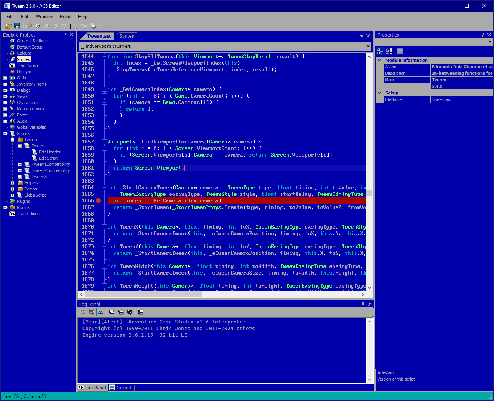
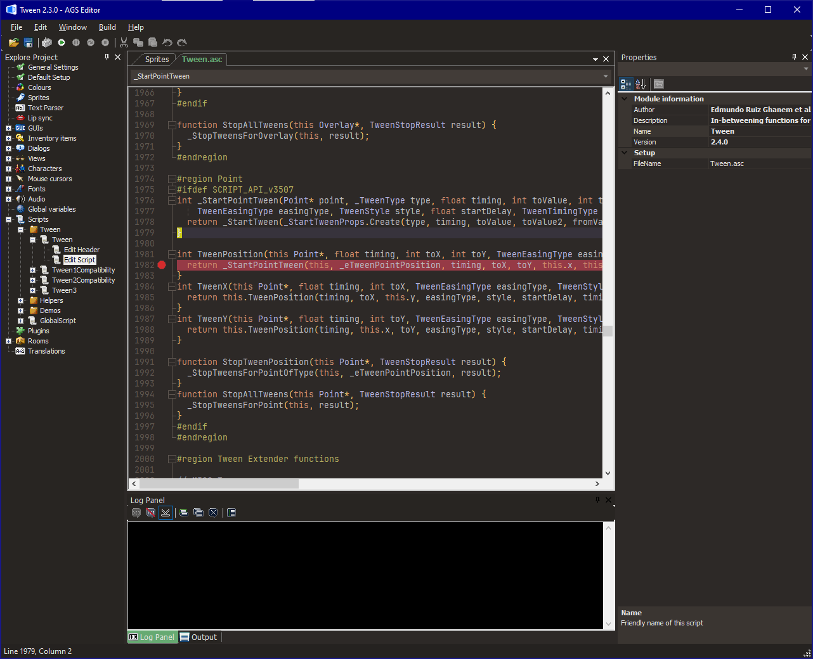

# edmundito's AGS Editor themes

These themes are made for the [Adventure Game Studio](https://adventuregamestudio.co.uk/) editor.

## Installation

1. Close the AGS Editor
2. Run `install.bat` to copy the themes to the editor's themes folder
3. Open the AGS Editor
4. Go to File -> Preferences and select from the Color Themes dropdown

## Themes

### DOS EGA

A blue theme inspired by the old MS-DOS programming editors like QBASIC and Borland Turbo C++. Uses an EGA 16-color palette.

**Recommended font:** [Modern DOS](https://www.dafont.com/modern-dos.font), Variant 8x16, Size 12

### Rosewater

A dark theme inspired by the game [Rosewater](https://www.grundislav.games/Rosewater.html) by [Grundislav Games](https://grundislav.games/) featuring brown and gold colors.

